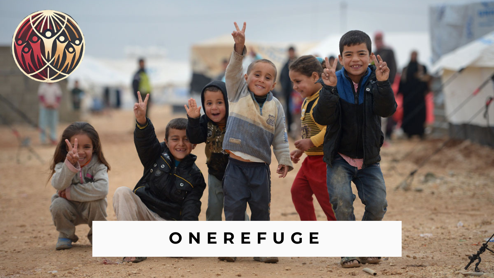

# OneRefuge

## Helping refugees navigate new beginnings

Seeking asylum in an unfamiliar world is far more complex and arduous than privileged individuals could ever anticipate. 
Refugees are tasked with familiarizing themselves to foreign languages, acclimating to unfamiliar policies, finding the 
right support centres, and a variety of other considerations. 

Driven by the intent to address this humanitarian issue and to reduce the strain on overwhelmed aid organizations and systems,
we've created OneRefuge, a digital platform that aims to provide immediate and accurate answers to point refugees in the right 
direction, while empowering them and insuring their dignity in their new lives. It acts as an aggregator of information to support 
refugees settling in Canada such as:

* Healthcare 
* Legalities
* Food Services
* Housing
* Communities
* Job Opportunities
* Services (ex: Language Aquisition)

## Watch the following video to understand how the website works!

## How to access the website's front-end?

We currently are not hosting this websit so the only way to access the website is through your own server. You can use Visual Studio Code to do so. Follow the steps below to have access to the front-end (back-end instruction will follow).

1. Clone the repository to your computer (or simply download it manually)

2. On VS Code, download the "Live Preview" plug-in by Microsoft.

3. Right click the "homepage.html" file and click on "Show Preview"

4. Copy the link on the bar to your own personal browser.

## How to access the website's back-end?

To have access to the back-end of the website, additional software must be installed: xampp. Once you have access to it, you can host the website on your local server, and the website will have the backend as well as the front-end.

## Credits

This project was completed in 24 hours at the McGill Hackathon (McHacks) in which more than 400 students from many prestigious institutions around the world came to create solutions to modern day problems. It was an honor for all of us to participate in this prestigious competition with some of the brightest minds.

We were a team of 3 people: Dawoud Naseem, Rayyan Ahmad Khan, and Mahdi Rahman. I (Dawoud Naseem) worked on most of the front-end by using HTML, CSS, and Flexbox. Rayyan also worked on some of of the front-end, but he mostly researched all of the essential informations relating to refugees. Finally, Mahdi did all of the back-end which included creating a database for the users' credentials some of the animations.

## Found a bug?

If you found an issue or would like to submit an improvement to this project, please submit an issue using the issues tab above. Or you can email any one of the main colloborators (Dawoud, Mahdi, & Rayyan).

## Known issues and Future Goals

This project is still a work in progress since we were not able to implement three things: 

1. The chatbot we included on the webiste does not work since we do not have the knowledge required to train a bot to answer relevant questions (in any language) to refugees.

2. We were planning on using an API to translate the whole website for us in any languages in the world, but we found no APIs that were cheap or accesible to us. This was a huge let down since that was one of the main goals of this website: to create a website that is accesible by anyone anywhere around thw world who wants to seek asylum in Canada. Since we can't use APIs, it is better to train a bot such as the one OpenAI offers since it knows already how to speak in various languages.

